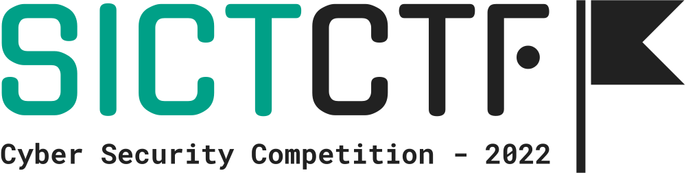
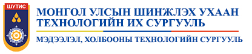

# SICT CTF - 2022: Challenges

Зорилго:
----------
Шинжлэх Ухаан Технологийн Их Сургуулийн бүрэлдэхүүн Мэдээлэл Холбооны Технолгийн Сургуулийн Мэдээллийн сүлжээ, аюулгүй байдлын салбарын харьяа **Computer&Communication Security** клубээс **SICT CTF** тэмцээнийг оюутан залууст мэдээллийн аюулгүй байдлын талаар үнэн зөв, бодитой мэдлэг бий болгох, түгээн дэлгэрүүлэх, криптограф нууцлалын алгоритмууд, файлууд дээр шинжилгээ хийх, програмчлалын хэлний бодлогуудыг агуулсан тус салбарт шинэ чадварлаг авьяастныг илрүүлэх зорилготой тэмцээн зохион байгуулсан билээ.

Тэмцээний тухай:
----------
Уг тэмцээний нэгдүгээр шатанд 105 оюутан (ПХ, МТ, Сүлжээний Технологи, САБ, Хиймэл Оюун Ухаан), 44 баг өрсөлдөж 26 даалгаврыг 4 цагийн хугацаанд гүйцэтгэсэн. Үүнээс 34 баг ямар нэгэн байдлаар бодлого бодон оноо авч тэмцээний хоёрдугаар шат буюу финалын шатанд нийт 12 баг шалгарсан. Үүнд: Дүрмийн дагуу тус бүр "Зөвхөн I курсийн оюутнуудаас бүрдсэн", "Зөвхөн эмэгтэй оюутнуудаас бүрдсэн" нэг нэг багууд онооны самбарын жагсаалтаар эхний аравт шалгарсан багууд дээр нэмэгдэж шалгарсан байна.  

Тэмцээний финалын шат нь танхимын хэлбэрээр 2022 оны 11-р сарын 26-ны өдөр ШУТИС-ийн эрдэм шинжилгээ, инновацын төв VIII байрны олон улсын эрдэм шинжилгээний хурлын танхимд 11:00~19:00 цагийн хооронд зохиогдсон бөгөөд 12 багаас 11 баг ирж 31 оюутны бүрэлдэхүүнтэй нийт 23 даалгавраас 18 даалгаврыг 4 цагийн хугацаанд гүйцэтгэн:  
<ul>
<li>🥇Тэргүүн байрыг "J4zzing" баг 13492 оноогоор</li>  
<li>🥈Хоёрдугаар байрыг "Hicheejiinoo" баг 9386 оноогоор</li>  
<li>🥉Гутгаар байрыг "road to soonchunhyang" баг 7609 оноогоор</li>  
<li>🎖Тусгай байрыг "jinkneesee hamgiin suga n" баг 6507 оноогоор тус тус тэргүүлж өргөмжлөл, мөнгөн шагналын эзэн боллоо.</li>
</ul>

Зохион байгуулагч:
----------
  

Сошиал хаягууд:
----------

